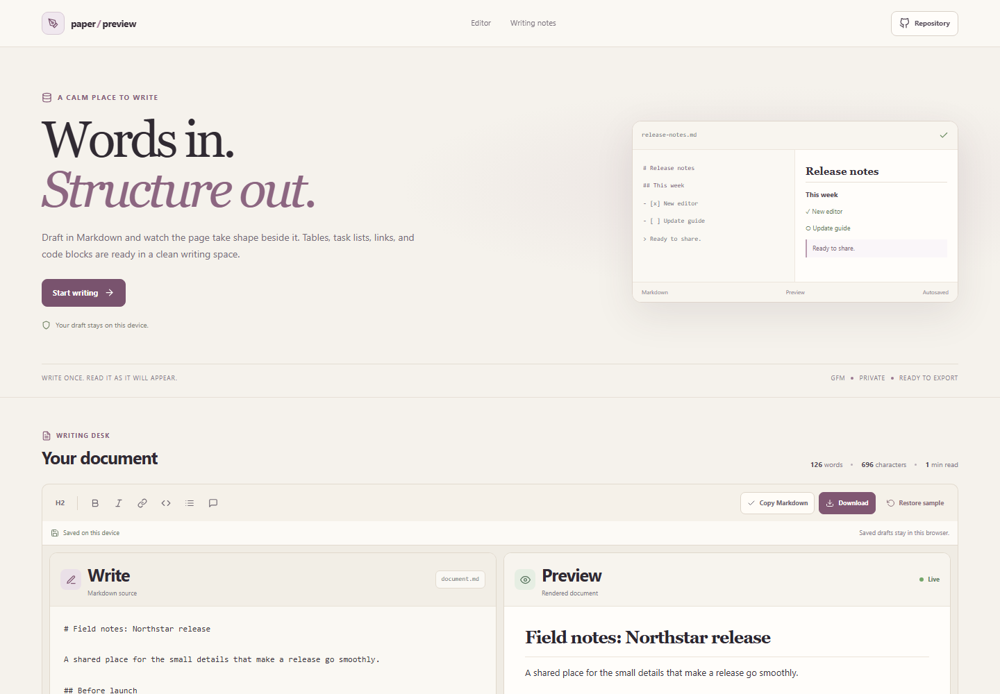



# Markdown Editor

Write Markdown with a live GitHub-flavored preview. Drafts autosave locally in the browser, and you can copy the source or download it as a Markdown file.

**Live app:** [https://a2rp.github.io/markdown-editor/](https://a2rp.github.io/markdown-editor/)

## How to use it

Edit the source in the left pane and read the rendered document in the preview pane. The preview updates as you type. Use the toolbar to insert a heading, bold or italic markup, a link, inline code, a bullet item, or a quote. Select text first to wrap it with bold, italic, code, or link syntax.

Choose **Write**, **Split**, or **Preview** to change the workspace layout. The browser saves the current draft to local storage on this device. Select **Copy Markdown** to copy the source, or **Download** to save it as document.md. **Restore sample** asks before replacing your draft with the example.

## What is included

- Live GitHub-flavored Markdown preview, including tables, task lists, strikethrough, autolinks, block quotes, and fenced code blocks.
- A source editor with insertion controls and Tab key support for adding two spaces.
- Write-only, preview-only, and split workspace layouts.
- Word, character, line, and estimated reading-time counts.
- Local draft autosave and restoration after a refresh.
- Copy and Markdown download actions.
- A keyboard-accessible confirmation dialog before replacing a draft.
- Raw HTML in Markdown is displayed as text, not executed.
- Responsive layout, a fixed header, repository link, footer links, and a back-to-top button after scrolling 50 pixels.

## Data and limits

The current draft is stored in this browser's local storage under a single app key. It is not uploaded to a server. Browser storage can be cleared by the browser or its user, and the saved draft is available only in this browser profile on this device. Restoring the sample replaces the saved draft.

The preview uses GitHub-flavored Markdown. It does not execute embedded HTML, and it does not promise to match every publishing platform's styles. The editor has one active draft and does not include multi-document history or cloud sync.

## Run locally

~~~sh
npm install
npm run dev
~~~

## Check and deploy

~~~sh
npm run lint
npm test
npm run build
npm run deploy
~~~

The deploy command builds the app and publishes dist to the gh-pages branch. The live site is [https://a2rp.github.io/markdown-editor/](https://a2rp.github.io/markdown-editor/).

## Future improvements

These are ideas that are not implemented yet:

- Add multiple named drafts and a recent-document list.
- Add a table of contents generated from document headings.
- Add optional HTML and PDF export.
- Add an option to download and import Markdown files from the editor.

## Links

- Portfolio: [https://www.ashishranjan.net](https://www.ashishranjan.net)
- GitHub: [https://github.com/a2rp](https://github.com/a2rp)
- CodePen: [https://codepen.io/ash1198](https://codepen.io/ash1198)
- LinkedIn: [https://www.linkedin.com/in/aashishranjan](https://www.linkedin.com/in/aashishranjan)
- Facebook: [https://www.facebook.com/theash.ashish/](https://www.facebook.com/theash.ashish/)
- YouTube: [https://www.youtube.com/@ashishranjan-ashz?sub_confirmation=1](https://www.youtube.com/@ashishranjan-ashz?sub_confirmation=1)
- Email: [mailto:ash.ranjan09@gmail.com](mailto:ash.ranjan09@gmail.com)

## Support

- Support: [https://a2rp-donation-page.netlify.app/](https://a2rp-donation-page.netlify.app/)
- Buy Me a Coffee: [https://buymeacoffee.com/ashishranjan](https://buymeacoffee.com/ashishranjan)
- Patreon: [https://www.patreon.com/ashishranjan](https://www.patreon.com/ashishranjan)
